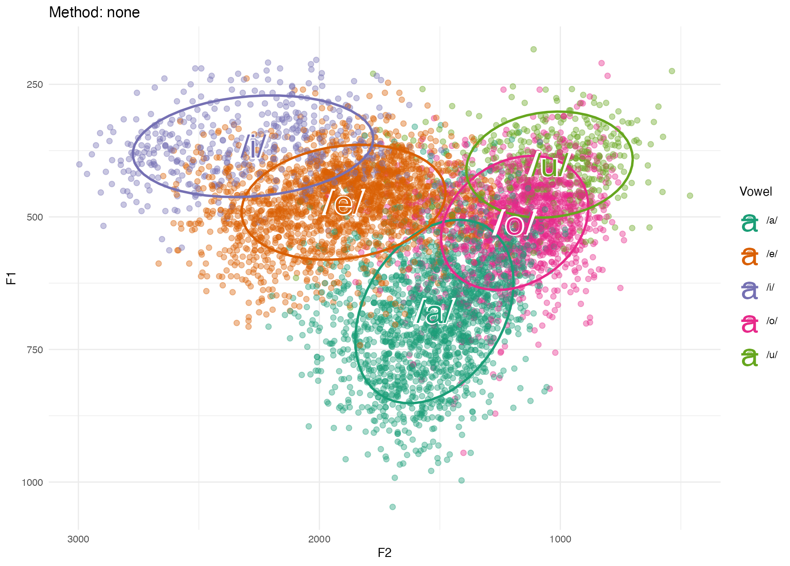

# vowel Figures
 Plots vowels in 2D (using phonR package) and 3D (using scatterplot)

 This is a Rshiny app hosted [here](https://wendyelvira.shinyapps.io/plotVowels/)

In order to make it work you need to visit the webpage and upload your database there. Alternatevily you can download the files and use the in RStudio in you computer.
 
## Input
 An Excel file  with formant values (F1 and F2) and the following format (an example is also provided in this same repository). You will need F3 values if you want 3D.
  
vocal | f1 | f2 | f3
------------ | ------------- | ------------- | -------------
a | 1000 | 1500| 3000
a | 1001 | 1520| 3020
a | 1010 | 1500| 3010
 
## Output
Figures that can be saved with right click or dragging to Desktop.

>[!TIP]
> Elvira-García, Wendy. 2021. A RShiny interface for plotting vowel formants. [RShiny App]